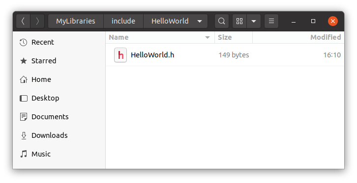

# Library Building and Usage with CMake

## Building and Installing a Library

Create a folder "library-project" and create in the folder the following three files:
* HelloWorld.h
```C++
#pragma once

#include <string>


class Greeter
{
public:
    Greeter(std::string name);
    void greet();
    
private:
    std::string m_Name;
};
```
* HelloWorld.cpp
```C++
#include <iostream>
#include "HelloWorld.h"


Greeter::Greeter(std::string name)
    : m_Name(name)
{}


void Greeter::greet()
{
    std::cout << "Greetings, " << m_Name << "!" << std::endl;
}
```
* CMakeLists.txt
```cmake
cmake_minimum_required(VERSION 3.5)
project(HelloWorld VERSION 1.0)

## Compile as C++11
set (CMAKE_CXX_STANDARD 11)
set (CMAKE_CXX_STANDARD_REQUIRED YES)

## Set library installation directories
set (MY_INCLUDE_DESTINATION ~/MyLibraries/include)
set (MY_LIB_DESTINATION ~/MyLibraries/lib)
set (MY_BIN_DESTINATION ~/MyLibraries/bin)


# Add all cpp files to source
file(GLOB HelloWorldSrc "*.cpp") 	
# Build the library
add_library (HelloWorld ${HelloWorldSrc})


# Install built library to destination
install(TARGETS 
  HelloWorld
  ARCHIVE DESTINATION ${MY_LIB_DESTINATION}
  LIBRARY DESTINATION ${MY_LIB_DESTINATION}
  RUNTIME DESTINATION ${MY_BIN_DESTINATION}/${PROJECT_NAME}
)

# Install headers to destination
file(GLOB headers "*.h" "*.hpp")
install(FILES ${headers}
  DESTINATION ${MY_INCLUDE_DESTINATION}/${PROJECT_NAME}
)
```

To build and install the library, go to the folder and launch the following commands:
```bash
$ mkdir build
$ cd build
$ cmake ..
$ make
$ sudo make install
```
After the building and installing, you will find the directory "~/MyLibraries/". Below shows the contents of the directory.




## Using a Library

Create a folder "user-project" and create in the folder the following two files:
* main.cpp
```C++
#include "HelloWorld/HelloWorld.h"


int main(int argc, char* argv[])
{
    Greeter greeter("Xianghui");
    greeter.greet();
}
```
* CMakeLists.txt
```cmake
cmake_minimum_required(VERSION 3.5)
project(LibTester VERSION 1.0)

## Compile as C++11
set (CMAKE_CXX_STANDARD 11)
set (CMAKE_CXX_STANDARD_REQUIRED YES)

## Set library directories
set (MY_INCLUDE_DESTINATION ~/MyLibraries/include)
set (MY_LIB_DESTINATION ~/MyLibraries/lib)

include_directories(${MY_INCLUDE_DESTINATION})
link_directories(${MY_LIB_DESTINATION})


	
# Build the executable
add_executable (main main.cpp)

# link to libHelloWorld
target_link_libraries(main HelloWorld)
```
To build the project, go to the folder and launch the following commands
```bash
$ mkdir build
$ cd build
$ cmake ..
$ make
# run the program
$ ./main
```

## More Advanced Techniques

If needed, we can introduce versioning and make a system wide installation and use find_package() instead of hard coding a directory. For details, see [https://foonathan.net/2016/03/cmake-install/](https://foonathan.net/2016/03/cmake-install/)

[Back to Contents](../README.md)
